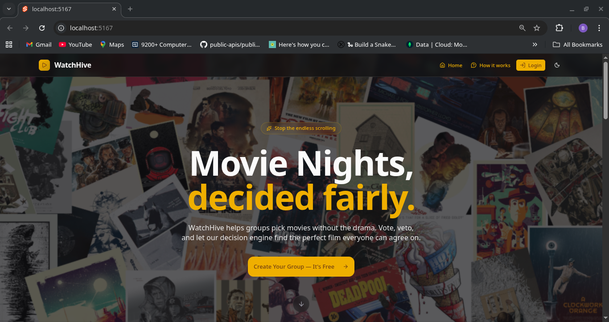
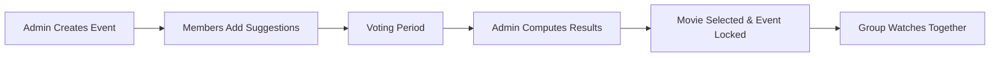

# 🎬 WatchHive - Collaborative Movie Night Decision Making

WatchHive is a full-stack application designed to solve the age-old problem of groups struggling to pick a movie to watch together. With a sophisticated voting engine, real-time updates, and comprehensive group management features, WatchHive transforms chaotic group debates into a fair, transparent, and efficient decision-making process.

---

## The Problem Solved

Groups face several challenges when planning movie nights:

- **Endless debates** over what to watch
- **No fair voting system** where everyone has a voice
- **One person's strong dislike** being overlooked
- **Disorganized suggestions** scattered across different chats
- **No clear final decision** mechanism

**WatchHive eliminates these pain points** with a structured, democratic approach that respects everyone's preferences while ensuring a decision gets made.

---

## Project screenshot



---

## Core Features

### Intelligent Decision Engine

The voting system ensures fair movie selection:

| Vote Type    | Value                    | Impact                                    |
| ------------ | ------------------------ | ----------------------------------------- |
| **Upvote**   | +1                       | Increases movie's chances                 |
| **Downvote** | -1                       | Decreases movie's chances                 |
| **Veto**     | Instant Disqualification | Removes movie from consideration entirely |

**Key Voting Rules:**

- Each member gets **one suggestion** per movie night event
- Members can vote on all suggestions (except their own)
- A single **veto disqualifies** a movie (ensures nobody has to watch what they hate)
- Vetos can be **undone**, restoring the movie to active voting
- **Real-time updates** via SignalR keep everyone in sync

### Tie-Breaking Algorithm

When multiple movies have the same score, tie-breakers are applied in this order:

```
Score = (Upvotes × 1) + (Downvotes × -1)
```

1. **Highest Upvote Count** - Most popular choice wins
2. **Lowest Downvote Count** - Least disliked wins
3. **TMDB Rating** - Critically acclaimed movies get priority
4. **Earliest Suggestion** - First come, first served

### Group Management

**Group Creation & Membership:**

- Create groups and automatically become **Group Admin**
- Send **invitations** to registered users
- Users can **search and request** to join groups
- Admins **approve/reject** join requests

**Admin Powers:**

- Promote members to **co-admin** status
- Revoke admin privileges (except for group creator)
- Remove members from groups
- Create and manage **Movie Night Events**

### Real-Time Communication

**Event-Scoped Chat:**

- Dedicated chat room for each Movie Night Event
- Real-time messaging via SignalR
- Discuss suggestions and coordinate viewing plans
- All conversations stay within event context

**Live Notifications:**

- Snackbar alerts for important events
- Real-time voting updates
- Final movie selection announcements

### Authentication & Security

**Complete JWT Authentication Flow:**

- User registration with **email verification**
- Secure login with JWT tokens
- Password reset via email
- "Forgot Password" functionality
- Protected API endpoints

### Movie Night Event Lifecycle



---

## Tech Stack

### Frontend

| Technology         | Purpose                           |
| ------------------ | --------------------------------- |
| **Svelte**         | Reactive UI framework             |
| **Svelte-Shadcn**  | UI Component Library              |
| **TypeScript**     | Type-safe development             |
| **TanStack Query** | Server state management & caching |
| **Tailwind CSS**   | Utility-first styling             |
| **SignalR Client** | Real-time WebSocket connections   |

### Backend

| Technology                | Purpose                               |
| ------------------------- | ------------------------------------- |
| **ASP.NET Core**          | REST API framework                    |
| **Entity Framework Core** | ORM for database operations           |
| **PostgreSQL**            | Relational database                   |
| **SignalR**               | Real-time bidirectional communication |
| **JWT Bearer**            | Authentication middleware             |

### External APIs

| Service      | Usage                                |
| ------------ | ------------------------------------ |
| **TMDB API** | Movie metadata, ratings, and details |

---

## Getting Started

### Prerequisites

- [.NET 10 SDK](https://dotnet.microsoft.com/download/dotnet/10.0)
- [Node.js 18+](https://nodejs.org/) (for frontend development)
- [Docker](https://www.docker.com/products/docker-desktop/) (for PostgreSQL)
- [Git](https://git-scm.com/)

### Installation Steps

#### 1. Clone the Repository

```bash
git clone https://github.com/KOKUMUbooker/watchhive.git
cd watchhive
```

#### 2. Set Up Environment Variables

Some considerations

- Sending emails is done via google SMTP Server.
  - To get EmailConf\_\_Password & EmailConf\_\_Port, you can get them from a google gmail account. I'd recommend looking up "Setting up an SMTP server using gmail account" if unsure.
- For TMDB\_\_ApiKey, you'll need to create an account with TMDB and obtain an api key from their dashboard.
- To generate CLIENT_SECRET correctly, I'd recommend using passing a really long string to base64 command eg
  - `echo -n "<some-really-long-phrase>" | base64`

```bash
cp env.example .env
```

#### 3. Start PostgreSQL with Docker

```bash
docker compose -f docker-compose-db.yaml up -d
```

### 4. Install Project Dependencies

```bash
dotnet restore
```

#### 5. Install EF Core Tools

```bash
dotnet tool restore
```

#### 6. Apply Database Migrations

```bash
# Create initial migration (NOTE: SKIP IF Migrations folder has files)
dotnet ef migrations add InitialCreate

# Apply to database
dotnet ef database update
```

#### 7. Running application as single unit (Building)

```bash
# Will build the UI then copy its files into wwwroot so that the server will serve lates UI code
dotnet publish -c Release

# Run server as usual, and access the UI from the server endpoint
dotnet run
```

##### Frontend will be available at `http://localhost:5167`

##### Backed also available at `http://localhost:5173`

##### **Scalar UI**: `https://localhost:5167/scalar`

---

OR

### Running the Backend and UI separately

#### 7. Run the Backend API

```bash
# Development with hot reload
dotnet watch run

# Or standard run
dotnet run
```

The API will be available at:

- **HTTP**: `http://localhost:5167`
- **Scalar UI**: `https://localhost:5167/scalar`

#### 8. Run the Frontend (Separate Terminal)

- To allow the UI to communicate with the backend, change this file `watch-hive/UI/src/api/urls.ts` url variable to use localhost ie

```js
// ONLY IN DEV (If running backend and UI separately)
export const API_BASE_URL = 'http://localhost:5167';
// FOR PROD OR running app as a single unit - leave empty & let it use relative urls
// export const API_BASE_URL = "";
```

```bash
cd UI
npm install
npm run dev
```

##### Frontend will be available at `http://localhost:5173`

### Useful Scripts

- `dbReset.sh` - For droping the database and applying the latest migration to the db
- `build-artifact.sh` - For creating an artifact for deployment to monsterasp.net
